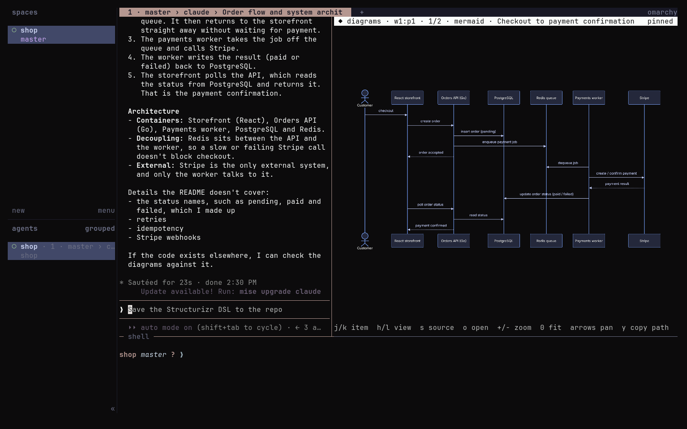
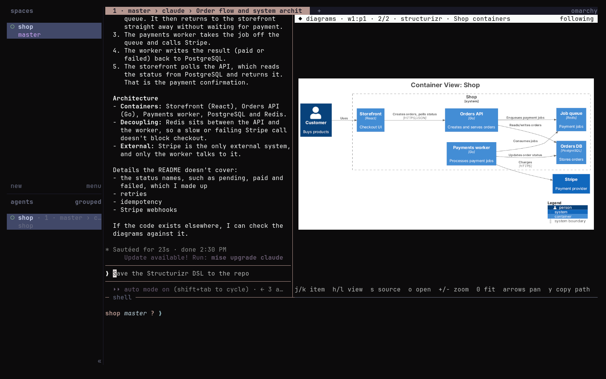
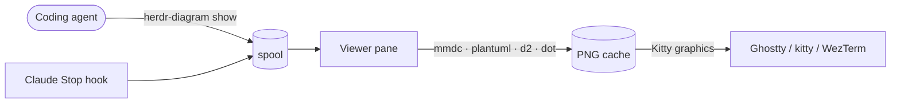
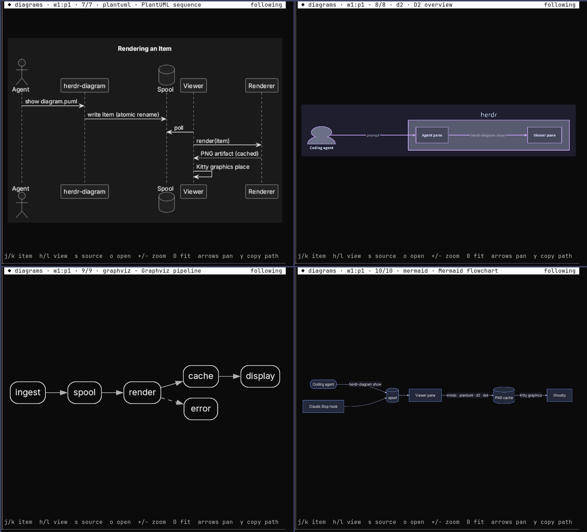
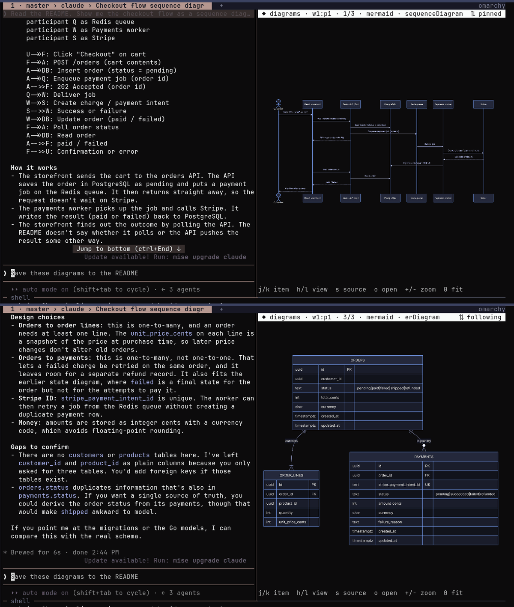

# herdr-diagrams

Your coding agent draws a diagram; you see a picture, not a code block.

A [Herdr](https://herdr.dev) plugin that renders **Mermaid, PlantUML, Structurizr (C4), D2
and Graphviz** diagrams, and plain images, from **Claude Code, Codex, opencode, Copilot CLI,
agy** and any other agent that can run a shell command. The images appear in a split pane
next to the agent, drawn with the Kitty graphics protocol.





## How it works



- A shared **skill** teaches every agent to call `herdr-diagram show`. The first diagram
  opens a viewer pane beside the agent's pane; later ones appear in it.
- `show` renders before it returns. A broken diagram comes back to the agent as an error
  with a line number, so the agent fixes it instead of telling you it worked.
- For Claude Code, an optional **Stop hook** also picks up ` ```mermaid ` (and other
  diagram) blocks from its answers, without the agent doing anything.
- **The viewer follows the chat.** Scroll the agent's conversation back and the viewer
  switches to the diagram on screen; scroll down and it follows the newest again.
- Every agent pane gets its own viewer, in every space, tab and herdr session.
- Renderers are configuration, not code: add a format by editing `renderers.toml`.





## Platforms

| Platform | Status |
|---|---|
| Linux | Tested: Ghostty 1.3 + herdr 0.9.3 on Arch, all formats, Claude Code, opencode and Copilot CLI skill discovery |
| macOS | Supported, not yet tested on a Mac. Uses only POSIX APIs available there; uses `open`, `pbcopy`, `sips` and Chrome from `/Applications` where Linux uses `xdg-open`, `wl-copy`, ImageMagick and Chromium. If `python3` is Apple's 3.9, the command switches to a newer Python on `PATH` or from Homebrew. CI runs the tests on macOS. |
| Windows | Not supported yet. See [ADR-0010](docs/adr/0010-platform-support.md) for what is missing. |

## Requirements

- Herdr 0.9.3 or later, with `[terminal] kitty_graphics = true` (the default)
- A terminal with the Kitty graphics protocol: Ghostty, kitty or WezTerm
- Python 3.11 or later, Node.js 18+ and npm
- Per format, as you need them:

  | Format | Tool | Arch | Debian/Ubuntu | macOS |
  |---|---|---|---|---|
  | Mermaid | bundled (`@mermaid-js/mermaid-cli`) | | | |
  | PlantUML (1.2024+ for the dark theme) | `plantuml` (Java) | `pacman -S plantuml` | [plantuml.jar](https://plantuml.com/download) wrapper; apt's is too old | `brew install plantuml` |
  | Graphviz | `dot` | `pacman -S graphviz` | `apt install graphviz` | `brew install graphviz` |
  | D2 | `d2` | `mise use -g d2` | [install script](https://d2lang.com/tour/install) | `brew install d2` |
  | Structurizr | `structurizr-cli` + PlantUML | [release zip](https://github.com/structurizr/cli/releases) | same | `brew install structurizr-cli` |
  | SVG/JPEG images | `rsvg-convert`, `magick` or `ffmpeg` | usually present | `apt install librsvg2-bin` | `brew install librsvg` |

## Install

```sh
herdr plugin install jellespijker/herdr-diagrams
herdr plugin action invoke herdr-diagrams.install-skill
herdr plugin action invoke herdr-diagrams.doctor
```

`install-skill` links the skill and the `herdr-diagram` command (symlinks, nothing copied):

| Link | Used by |
|---|---|
| `~/.agents/skills/herdr-diagrams` | Codex, opencode, Copilot CLI, Gemini CLI |
| `~/.claude/skills/herdr-diagrams` | Claude Code |
| `~/.gemini/config/skills/herdr-diagrams` | Antigravity CLI (agy), if installed |
| `~/.local/bin/herdr-diagram` | the command line |

Optional, for Claude Code: show diagrams from its answers automatically.

```sh
herdr-diagram install-hook claude      # edits ~/.claude/settings.json, keeps a backup
```

Optional key binding in `~/.config/herdr/config.toml`:

```toml
[[keys.command]]
key = "prefix+d"
type = "plugin_action"
command = "herdr-diagrams.open"
description = "open diagram viewer"
```

## Use

Ask your agent to explain something "with a diagram". Or show one yourself from any pane:

```sh
herdr-diagram show docs/architecture.dsl
herdr-diagram show --title "Login" - <<'EOF'
sequenceDiagram
    User->>App: open
    App->>Auth: authorize
EOF
herdr-diagram show screenshot.png
```

When a diagram is broken, nothing is queued and the error goes to whoever called `show`:

```
$ herdr-diagram show checkout.mmd
herdr-diagram show: mermaid render failed: mmdc exited with 1
Error: Parse error on line 3:
...t  checkout --> pay[Pay]
---------------------^
Expecting 'SQE', 'DOUBLECIRCLEEND', 'PE', ... got 'SQS'
Nothing was queued. Fix the diagram and run show again.
```

### Viewer keys

| Key | Action |
|---|---|
| `j` / `k` | Next / previous diagram (pauses scroll sync) |
| `i` | List of all diagrams of this pane; `Enter` shows one, `e` exports it |
| `e` / `E` | Export this diagram / all diagrams (PNG, SVG and source) |
| `h` / `l` | Previous / next view of a Structurizr workspace |
| `+` / `-` / `0` | Zoom in / out / fit |
| arrows | Pan when zoomed |
| `s` | Toggle the diagram source |
| `o` | Open the image in your default viewer |
| `y` | Copy the image path |
| `r` | Follow the newest diagram again |
| `t` | Resume scroll sync after manual navigation, or turn it off and on |
| `q` | Close the viewer |

New diagrams take over the viewer until you move away from the newest; after that the
header counts them (`+2 new (r)`) instead.

**Scroll sync** (`⇅` in the header): about once a second the viewer reads the text visible
in the agent's pane. It looks for the `[diagram: <title>]` line the skill asks agents to
write next to each diagram, or for the diagram's own source lines when the agent printed
the diagram in its answer. The bottom-most match wins. Navigating yourself (`j`, `k`, `g`, the
list) pauses sync (`⇅ paused`) until you press `t` or `r`.

### Export

`e` in the viewer, or `herdr-diagram export` from a shell, writes each diagram as PNG, SVG
and its source file (`.mmd`, `.puml`, `.dsl`, `.d2`, `.dot`), in the light theme, to
`diagrams/` in the agent's working directory:

```sh
herdr-diagram export                     # newest diagram of this pane
herdr-diagram export --all --svg         # every diagram, SVG only
herdr-diagram export -n 2 -d docs/img    # second newest, into docs/img
herdr-diagram export --all --archived    # include diagrams of earlier sessions
```

Existing files with the same content are left alone; a different file with the same name
gets a `-2` suffix.

### Cleanup

Diagrams are archived, not deleted, and `gc` deletes archives after 7 days:

| When | What happens |
|---|---|
| A new agent session starts in a pane | Diagrams of earlier sessions in that pane are archived; the viewer shows the new session only |
| A pane closes | Its viewer closes; its diagrams are archived |
| A pane moves to another tab or space | Its diagrams move with it |
| herdr starts (plugin startup) | Diagrams of panes that no longer exist are archived; `gc` runs (7 days) |

### Commands

```
herdr-diagram show [FILE|-]      queue a diagram or image for the viewer beside this pane
herdr-diagram list               diagrams shown from this pane
herdr-diagram render FILE -o X   render to a PNG file, no viewer
herdr-diagram export             write PNG, SVG and source files (see Export)
herdr-diagram open               open the viewer beside this pane
herdr-diagram doctor             check herdr, graphics, renderers and links
herdr-diagram install-skill      link skill and CLI (--status, --uninstall)
herdr-diagram install-hook claude
herdr-diagram gc                 delete diagrams, archives and images older than 7 days
```

## Configure

Files live in the plugin config dir (`herdr plugin config-dir herdr-diagrams`):

- `config.toml`:
  - `theme = "dark"` (default) or `"light"`. `HERDR_DIAGRAMS_THEME` overrides it.
  - `scroll_sync = true` (default) or `false`.
  - `export_dir = "{cwd}/diagrams"` (default); `{cwd}` is the agent's working directory,
    `{home}` your home directory.
  - `export_theme = "light"` (default) or `"dark"`.
- `renderers.toml`: override a bundled renderer or add one. Example, a self-hosted
  [Kroki](https://kroki.io) for BPMN:

  ```toml
  [bpmn]
  detect = ["bpmn"]
  argv = ["curl", "-sf", "--data-binary", "@{in}", "http://localhost:8000/bpmn/png", "-o", "{out}"]
  in_ext = "bpmn"
  out = "png"
  ```

State lives in `~/.local/state/herdr-diagrams` (`HERDR_DIAGRAMS_HOME` overrides it):
diagrams per herdr session and pane under `spool/<session>/<pane>/`, archived ones under
`archive/`, rendered images in `cache/`, the last 50 herdr events in `events.log`.

## Security

Diagram sources come from agents, so they are treated as untrusted input:

- Renderers run as argv lists, never through a shell.
- PlantUML runs with `PLANTUML_SECURITY_PROFILE=SANDBOX`: no file includes, no URL fetches.
- Structurizr sources using `!script`, `!plugin` or a remote `!include`, and D2 sources with
  remote icons or images, are refused (`reject` in `renderers.toml`).
- Mermaid's headless Chromium keeps its sandbox and has all network traffic sent to a
  dead proxy.
- Nothing is sent to an online renderer. Add one yourself only if you trust it with your
  diagrams.
- Limits: 1 MiB source, 20 MiB image, 30 to 90 s render time; on timeout the renderer's
  whole process group (Chromium, Java) is killed.
- Titles, sources and renderer errors are stripped of terminal control characters before
  they are drawn.
- `install-hook` edits the target of a symlinked `settings.json`, keeps its file mode and
  writes a backup.

## Troubleshooting

`herdr-diagram doctor` checks everything below.

- **The viewer shows nothing where the image should be.** Your terminal does not speak
  the Kitty graphics protocol, or `kitty_graphics` is off in herdr's config. Press `o` to
  open the image externally.
- **`renderer not installed: plantuml`.** Install the tool from the table above.
- **Mermaid fails with a browser error.** Run `npx puppeteer browsers install
  chrome-headless-shell` in the plugin directory, or install Chromium; the plugin falls
  back to a system Chromium or Chrome.
- **The agent does not use the skill.** Check `herdr-diagram install-skill --status`,
  then restart the agent. For Claude Code, `install-hook claude` works without the skill.

## Design

- [Specification](docs/spec.md)
- [Architecture decision records](docs/adr/)

## Development

```sh
npm install                       # mermaid-cli
uv sync                           # pytest, ruff, import-linter
uv run pytest -q
uv run ruff check src tests
PYTHONPATH=src uv run lint-imports
herdr plugin link "$PWD"
```

The runtime uses the Python standard library only.

## Related

- [hx-w/herdr-visuals](https://github.com/hx-w/herdr-visuals): Mermaid and LaTeX previews
  for Codex sessions.
- [haretoke/herdr-image-viewer](https://github.com/haretoke/herdr-image-viewer): the images
  an agent reads, with thumbnails.

## License

MIT
