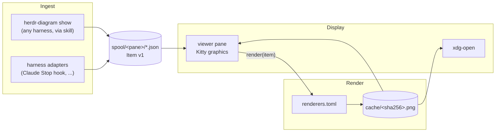

# herdr-diagrams — specification

Status: implemented in 0.1.0 (2026-10-02). Decisions behind this spec live in [`adr/`](adr/).

## 1. Purpose

Coding agents running in [Herdr](https://herdr.dev) panes (Claude Code, agy, opencode,
Codex, Copilot CLI, ...) often produce diagrams as text: Mermaid, PlantUML, Structurizr
DSL, D2, Graphviz. Their TUIs can only show that text. herdr-diagrams renders those
diagrams, and plain image files, to images and shows them in a herdr split pane beside
the agent, drawn with the Kitty graphics protocol.

### Goals

- Show a diagram an agent produced as a real image within a few seconds, without leaving herdr.
- Work with any harness that can run a shell command; add deeper integration per harness later.
- Add a diagram format by editing configuration, not code.
- Teach every agent how to use the tool through one shared skill.
- Ship as a single herdr plugin, installable with `herdr plugin install`.

### Non-goals

- Rendering images inline inside an agent's own TUI. Claude Code, agy and others redraw
  their screen and cannot emit graphics escapes from model output ([ADR-0004](adr/0004-display-kitty-graphics-in-herdr-pane.md)).
- Editing diagrams. The viewer is read-only.
- Installing heavy toolchains (Java, Go binaries, Chromium beyond what mermaid-cli pulls in).
- Windows support in v1.

## 2. Glossary

| Term | Meaning |
|---|---|
| **Harness** | The coding agent program running in a pane (Claude Code, agy, opencode, Codex, Copilot CLI). |
| **Source pane** | The herdr pane the harness runs in. Identified by `HERDR_PANE_ID`, for example `w1:p3`. |
| **Item** | One diagram or image queued for display. A JSON file following the Item contract (§4). |
| **Spool** | The directory tree where Items wait: one subdirectory per source pane. |
| **Format** | The diagram language of an Item: `mermaid`, `plantuml`, `structurizr`, `d2`, `graphviz`, `image`. |
| **Renderer** | An external command that turns a source of one format into an image. Declared in `renderers.toml`. |
| **Artifact** | A rendered image file in the cache, addressed by content hash. One Item yields one or more artifacts (Structurizr yields one per view). |
| **Viewer** | The TUI process in the herdr split pane that renders Items and displays artifacts. |
| **Display** | The mechanism that puts an artifact on screen. v1: Kitty graphics written to the viewer pane. |
| **Adapter** | Harness-specific code that finds diagrams in a harness's output or transcript and writes Items. |

## 3. Architecture

Three stages joined by one file contract ([ADR-0001](adr/0001-pipeline-with-spool-contract.md)).



Rules:

- Ingest code writes Items. Adapters never render. The `show` CLI renders once before
  queueing, only to report errors to the agent ([ADR-0007](adr/0007-show-renders-before-queueing.md)).
- The renderer knows formats and commands. It never knows harnesses or panes.
- The display receives a path to a PNG and a cell box. It never knows formats.
- The viewer orchestrates: it reads the spool, asks the renderer for artifacts, hands them to the display.

## 4. Item contract v1

Defined in [ADR-0002](adr/0002-item-contract-v1.md). Validated against `schema/item.v1.json`.

### 4.1 Location

```
${HERDR_DIAGRAMS_HOME:-${XDG_STATE_HOME:-~/.local/state}/herdr-diagrams}/
  spool/<herdr-session>/<pane-key>/<created_ns>-<rand>.json
  viewers/<herdr-session>/<pane-key>.json
  archive/<herdr-session>/<pane-key>/<time>-<reason>/*.json
  cache/<sha256>.png | .svg
  daemon-<herdr-session>.lock
```

The folder is private (`0700`).

- `<herdr-session>` is `HERDR_SESSION`, or the name in `HERDR_SOCKET_PATH`
  (`.../sessions/<name>/herdr.sock`), or `default`. Pane IDs are only unique within one
  herdr session, so every per-pane path is scoped by it.
- `<pane-key>` is `HERDR_PANE_ID` with `:` replaced by `_` (`w1:p3` → `w1_p3`). Items written
  outside herdr go to `spool/_nopane/`.
- Writers create the file as `<name>.json.tmp` and `rename(2)` it into place, so the viewer
  never reads a partial file.
- The home is a fixed path, not `HERDR_PLUGIN_STATE_DIR`, because harnesses calling the CLI
  do not receive plugin environment variables.

### 4.2 Schema

```json
{
  "v": 1,
  "id": "1790942162755766418-a1b2",
  "format": "mermaid",
  "source": "flowchart LR\n  A --> B",
  "path": null,
  "title": "auth flow",
  "origin": {
    "harness": "claude",
    "pane": "w1:p3",
    "session": "4f1c...",
    "cwd": "/home/jelle/dev/jelle/foo",
    "via": "cli"
  },
  "created": 1790942162
}
```

| Field | Type | Required | Notes |
|---|---|---|---|
| `v` | int | yes | Contract version. Readers skip Items with an unknown major version and log once. |
| `id` | string | yes | Same as the file stem. Unique within the spool. |
| `format` | string | yes | A key of `renderers.toml`, or `image`. |
| `source` | string | one of | Diagram text. Max 1 MiB. |
| `path` | string | one of | Absolute path to a source file or image. Exactly one of `source` / `path` is set. |
| `title` | string | no | Shown in the viewer title. Defaults to the first meaningful source line. |
| `origin.harness` | string | no | `claude`, `agy`, `opencode`, `codex`, `copilot`, `unknown`. |
| `origin.pane` | string | no | Raw `HERDR_PANE_ID`. |
| `origin.herdr_session` | string | no | herdr session name, as used in the spool path. |
| `origin.session` | string | no | Harness session ID, if the adapter knows it. |
| `origin.cwd` | string | no | Used to resolve relative `!include`s where a renderer allows them. |
| `origin.via` | string | no | `cli` or the adapter name. |
| `created` | int | yes | Unix seconds. |

Additive optional fields do not bump `v`. Removing or changing a field does.

## 5. Format detection

Used when the caller gives no `--format`. First match wins:

1. `format` passed explicitly.
2. File extension: `.mmd .mermaid` → mermaid, `.puml .plantuml .pu` → plantuml,
   `.dsl` → structurizr, `.d2` → d2, `.dot .gv` → graphviz,
   `.png .jpg .jpeg .gif .webp .svg` → image.
3. Fenced block info string (adapters): ` ```mermaid `, ` ```plantuml `, ` ```puml `,
   ` ```structurizr `, ` ```d2 `, ` ```dot `.
4. First non-blank line of the source: `@startuml` → plantuml, `workspace` → structurizr,
   `digraph`/`graph {`/`strict` → graphviz, Mermaid diagram keywords (`flowchart`, `graph`,
   `sequenceDiagram`, `classDiagram`, `stateDiagram`, `erDiagram`, `gantt`, `mindmap`, ...) → mermaid.
5. Otherwise: error `cannot detect format`.

Each renderer entry lists its `detect` keys (§6) so detection and renderers stay in one file.

## 6. Renderers

Defined in [ADR-0003](adr/0003-renderers-as-data.md).

### 6.1 Registry

Bundled defaults in `<plugin root>/renderers.toml`, which is the source of truth. The user
can override or add entries in `$HERDR_PLUGIN_CONFIG_DIR/renderers.toml`
(`herdr plugin config-dir herdr-diagrams`); user entries replace bundled entries key by key.
The theme is chosen in `$HERDR_PLUGIN_CONFIG_DIR/config.toml` (`theme = "dark"` or `"light"`,
default dark) or with `HERDR_DIAGRAMS_THEME`.

Excerpt:

```toml
[mermaid]
detect = ["mermaid", "mmd"]
argv = ["{root}/node_modules/.bin/mmdc", "-q", "-i", "{in}", "-o", "{out}",
        "-s", "2", "-w", "1200", "-p", "{root}/puppeteer.json"]
in_ext = "mmd"
out = "png"
themes.dark = ["-c", "{root}/mermaid-dark.json", "-b", "transparent"]
themes.light = ["-c", "{root}/mermaid-light.json", "-b", "white"]

[plantuml]
detect = ["plantuml", "puml", "uml"]
argv = ["plantuml", "-tpng", "-pipe"]
stdio = true
env = { PLANTUML_SECURITY_PROFILE = "SANDBOX", PLANTUML_LIMIT_SIZE = "8192" }
themes.dark = ["--dark-mode"]

[structurizr]
detect = ["structurizr", "dsl", "c4"]
argv = ["structurizr-cli", "export", "-w", "{in}", "-f", "plantuml/c4plantuml", "-o", "{outdir}"]
in_ext = "dsl"
fanout = "*.puml"
then = "plantuml"
```

### 6.2 Entry fields

| Field | Meaning |
|---|---|
| `detect` | Detection keys (§5). |
| `reject` | Regular expressions (multiline). A matching source is refused before rendering, for constructs that run code or reach the network. |
| `argv` | Command. Placeholders: `{in}` input file, `{out}` output file, `{outdir}` scratch dir, `{root}` plugin root, `{cwd}` Item `origin.cwd`. No shell. |
| `in_ext` | Extension for the temporary input file. |
| `out` | Output extension. `png` for v1 displays; `svg` is converted to PNG before display. |
| `stdio` | Source on stdin, image on stdout, instead of `{in}`/`{out}`. |
| `fanout` | Glob in `{outdir}`; each match is one intermediate source. |
| `then` | Renderer key applied to each fanout match. Chains have depth 1 in v1. |
| `timeout` | Seconds, default 30. |
| `env` | Extra environment, for example `PLANTUML_LIMIT_SIZE`. |
| `themes.<name>` | Extra args appended for the configured theme (`dark`, `light`). |
| `svg_argv` | Command for SVG output, used by `export`. Without it, the format exports PNG and source only. |

### 6.3 Rendering

- Artifact key: `sha256(format, renderer entry as canonical JSON, theme, contents of plugin
  files the argv references (such as `mermaid-dark.json`), source bytes)`. A cache hit skips
  the renderer. Re-rendering on pane resize is free.
- Temporary files live in a per-render scratch dir under the cache; it is removed afterwards.
- Failure produces an error result: the viewer shows renderer name, exit code and the
  renderer's stderr without stack traces (at most 12 lines) instead of an image.
- A renderer whose `argv[0]` is not on PATH is "unavailable". Items in that format show a
  hint naming the missing tool; `doctor` lists it.
- `image` Items: PNG passes through; JPEG/GIF/WebP/SVG convert to PNG with the first
  available of `magick`, `rsvg-convert`, `ffmpeg`; otherwise "open externally" only.

### 6.4 Security

Diagram sources are written by agents and treated as untrusted ([ADR-0003](adr/0003-renderers-as-data.md)):

- No shell; argv only.
- PlantUML runs with `PLANTUML_SECURITY_PROFILE=SANDBOX` in its environment (no file includes,
  no URL fetch; the bundled stdlib such as C4-PlantUML stays available).
- Mermaid runs headless Chromium with the sandbox on and all network traffic sent to a dead
  proxy (`puppeteer.json`), so a diagram cannot fetch remote content.
- No network renderer (Kroki) by default. A user may add a self-hosted Kroki entry; the
  public kroki.io must never be a bundled default.
- Size limits: source 1 MiB, artifact 20 MiB, render timeout 30 s.

## 7. CLI

One entry point, `bin/herdr-diagram`, Python standard library only. On PATH through
`install-skill` (§10), which links it into `~/.local/bin`.

```
herdr-diagram show [--format F] [--title T] [--no-open] [--no-wait] [--pane P] [FILE | -]
herdr-diagram list [--pane P] [--json]
herdr-diagram render [--format F] [--theme dark|light] FILE -o OUT.png
herdr-diagram open [--pane P]
herdr-diagram view [--bind P]
herdr-diagram doctor
herdr-diagram install-skill [--harness H ...] [--uninstall] [--status]
herdr-diagram install-hook claude [--settings FILE] [--uninstall]
herdr-diagram allow claude [--settings FILE] [--uninstall]
herdr-diagram daemon
herdr-diagram hook claude-stop
herdr-diagram event
herdr-diagram export [--pane P] [--all | -n N] [--archived] [-d DIR] [--theme T] [--png] [--svg] [--src]
herdr-diagram gc [--older-than 7d]
```

| Command | Behaviour |
|---|---|
| `show` | Detect the format, render it once ([ADR-0007](adr/0007-show-renders-before-queueing.md)), write an Item for the current pane, and open a viewer beside the pane if none runs. On a render error: print the error, queue nothing, exit 1. `--no-wait` skips the render; `--no-open` (or `HERDR_DIAGRAMS_NO_OPEN=1`) skips the viewer. Diagram files are read into `source`; images keep their `path`. Harness and session come from `herdr pane get`. |
| `list` | Print the pane's Items, newest first. |
| `render` | Render a file without the spool, light theme by default. For agents that want a PNG in the repository. Multi-view sources write `OUT-1.png`, `OUT-2.png`, ... |
| `open` | Open the viewer beside a pane (the `open` plugin action). |
| `view` | Run the viewer in this terminal; the plugin pane's command. |
| `doctor` | Report: herdr binary and version, `HERDR_PANE_ID`, `kitty_graphics` setting, paths, each renderer available or missing, image conversion tool, skill link status. |
| `install-skill` | §10. |
| `install-hook` | Add or remove the Claude Code `Stop` hook in `~/.claude/settings.json` (§9.2). Idempotent; keeps other hooks; writes a `.bak-herdr-diagrams` backup. |
| `allow` | Add or remove `Bash(herdr-diagram:*)` and `Edit(<state folder>/**)` in Claude Code's `permissions.allow` ([ADR-0011](adr/0011-sandboxes-and-the-viewer-daemon.md)). |
| `daemon` | Background watcher, one per herdr session: opens viewers for new Items, fills in agent sessions ([ADR-0011](adr/0011-sandboxes-and-the-viewer-daemon.md)). Started by the plugin, not by hand. |
| `hook` | Harness hook entry point. Always exits 0 and prints nothing; errors go to `hook-errors.log` in the home. |
| `export` | Write the newest Item (or `-n`, or `--all`) as PNG, SVG and source into `export_dir` (default `{cwd}/diagrams`, light theme). Uses `svg_argv` from the registry for SVG. Same-content files are kept; different files get `-2`. |
| `event` | Plugin event and startup handler; see [ADR-0009](adr/0009-archive-on-lifecycle-events.md). |
| `gc` | Delete spool, archive and cache files older than the cutoff, then empty directories. Also run at plugin startup with 7 days. |

Exit codes: 0 ok, 1 runtime error (including render errors), 2 usage error, 3 format not
detected, 4 state folder not writable (sandbox).

## 8. Viewer

Runs as the plugin pane `viewer` (placement `split`). Bound to one source pane, passed via
`HERDR_DIAGRAMS_BIND` or derived from the pane the `open` action ran in.

### 8.1 Behaviour

- Polls the mtime of `spool/<pane-key>/` every 400 ms (standard library only; no inotify).
- Exits when its source pane has disappeared (checked every 5 s with `herdr pane get`).
- Follows the newest Item until the user navigates; then new Items increment a counter in
  the status line instead of taking over (`r` returns to follow mode).
- Renders on demand, newest first, in a worker thread; shows a spinner while rendering.
- Scales the artifact to fit the pane, keeping aspect ratio; re-fits on `SIGWINCH`.
- Multi-artifact Items (Structurizr) show `view 2/5` and use `h`/`l` to switch views.

### 8.2 Scroll sync

Defined in [ADR-0008](adr/0008-scroll-sync-by-chat-anchors.md). A watcher thread reads the
source pane's visible text every second (`herdr pane read --source visible`) and selects the
Item whose anchor appears lowest on screen:

- a marker line `[diagram: <title>]`, which the skill asks agents to write next to each
  diagram and which `show` prints as a reminder when an agent calls it;
- otherwise at least two distinctive source lines (diagram-type keywords and short lines
  are ignored), which covers diagrams printed in the answer and caught by the Stop hook.

Manual navigation (`j`, `k`, `g`, the list) pauses sync until `t` or `r`. `t` also toggles sync; `scroll_sync = false`
in `config.toml` turns it off. The same thread checks every 5 s whether the source pane
still exists; only an explicit `pane_not_found` from herdr stops the viewer.

### 8.3 Keys

| Key | Action |
|---|---|
| `j` / `k` | Next / previous Item |
| `h` / `l` | Previous / next view of a multi-artifact Item |
| `+` / `-` / `0` | Zoom in / out / fit |
| arrows | Pan when zoomed |
| `s` | Toggle source text |
| `o` | Open the artifact with `xdg-open` (macOS: `open`) |
| `y` | Copy artifact path to the clipboard |
| `r` / `G` | Follow newest (and resume sync) |
| `t` | Resume or toggle scroll sync |
| `i` | List of all Items; `Enter` show, `e` export, `Esc` close |
| `e` / `E` | Export this Item / all Items |
| `g` | First Item |
| `q` | Quit |

### 8.4 Display

Defined in [ADR-0004](adr/0004-display-kitty-graphics-in-herdr-pane.md).

- Kitty graphics protocol on the viewer's own stdout: transmit the PNG with chunked direct
  transmission (`a=t,f=100,t=d`, 4096-byte chunks), place it with `a=p,c=<cols>,r=<rows>,C=1`
  and, when zoomed, a source rectangle `x,y,w,h`. Each draw deletes the previous image
  (`a=d,d=I`) and transmits again: re-placing an image whose placement was deleted is not
  reliable through herdr 0.9.3, and artifacts are small.
- Cell size in pixels comes from `TIOCGWINSZ`, which herdr fills in; fit and zoom use it.
- Herdr forwards the graphics to the outer terminal when `[terminal] kitty_graphics = true`.
- When graphics are unavailable (`doctor` probe fails), the viewer shows the source text and
  the `o` hint. No sixel or block-character fallback in v1.

## 9. Harness integration

Defined in [ADR-0005](adr/0005-harness-integration-cli-and-skill-first.md).

### 9.1 Level 1 — CLI and skill (all harnesses)

The harness calls `herdr-diagram show` from its shell tool. The shared skill tells it when
and how. Works for every harness that can run a command; `HERDR_PANE_ID` is inherited from
the pane, so routing needs no harness cooperation.

### 9.2 Level 2 — adapters (per harness, on demand)

An adapter extracts fenced diagram blocks from a harness's finished turn and writes Items
with `origin.via = <adapter>`. Adapters import only the Item module.

| Harness | Mechanism | Priority |
|---|---|---|
| Claude Code | `Stop` hook: extract fenced blocks from the hook input's `last_assistant_message` and from the assistant text after the last human prompt in the transcript JSONL. Both are needed: Claude Code can run the hook before the final message reaches the transcript. Installed with `herdr-diagram install-hook claude`. | done (0.1.0) |
| Codex | Rollout JSONL of the bound session (session ID from herdr `report-agent-session`). | later |
| opencode | Session storage or plugin event, to investigate. | later |
| agy | Hook support unknown; level 1 only until investigated. | later |
| Copilot CLI | Level 1 only. | later |

De-duplication: an adapter skips a block whose `sha256(format, source)` matches an Item
already in the pane's spool in the last 10 minutes, so CLI and adapter can both be on.

## 10. Skill

One skill, `skills/herdr-diagrams/SKILL.md`, in Agent Skills format (frontmatter `name`,
`description`; markdown body). Content:

- When to draw: architecture, data flow, sequence, state machines, ER models, whenever a
  picture is shorter than the prose.
- How: `herdr-diagram show` with one short example per format, and heredoc usage.
- Format choice guidance: Mermaid by default; PlantUML/Structurizr for C4; Graphviz for
  large generated graphs.
- That the image appears in the side pane, and to run `herdr-diagram doctor` when nothing shows.
- Not to paste the rendered image path back into the chat unless asked.

`install-skill` symlinks the skill directory and the CLI. Verified 2026-10-02 against the
installed agents and their documentation:

| Link | Read by | Discovery checked |
|---|---|---|
| `~/.agents/skills/herdr-diagrams` | Codex, opencode, Copilot CLI, Gemini CLI | opencode (`opencode debug skill`), Copilot CLI (`copilot skill list`) |
| `~/.claude/skills/herdr-diagrams` | Claude Code (also opencode) | Claude Code loaded and used it in a live session |
| `~/.gemini/config/skills/herdr-diagrams` | Antigravity CLI (agy) | path from agy's built-in prompt and local layout; agy has no skill listing command |
| `~/.local/bin/herdr-diagram` | the CLI on PATH | yes |

The agy link is created only when `~/.gemini/config` exists, unless `--harness agy` is given.
It never overwrites a non-symlink; it reports and skips instead. `--uninstall` removes only
symlinks that point into this plugin.

## 11. Plugin manifest

```toml
id = "herdr-diagrams"
min_herdr_version = "0.9.3"
platforms = ["linux", "macos"]   # ADR-0010

[[build]]    # scripts/build.sh: npm ci + chrome-headless-shell
[[actions]]  # open, install-skill, uninstall-skill, doctor, gc
[[panes]]    # viewer (split): bin/herdr-diagram view
[[events]]   # pane.closed, pane.moved, pane.agent_detected -> bin/herdr-diagram event
[[startup]]  # bin/herdr-diagram event: prune panes that are gone, gc
[[panes]]    # doctor, install-skill, uninstall-skill (popup)
```

The `open` action and `show` both call `herdr plugin pane open --entrypoint viewer
--target-pane <source> --direction right|down --env HERDR_DIAGRAMS_BIND=<source> --no-focus`.
The direction is `right` when the source pane is at least 120 columns wide and wider than
2.2 times its height, else `down`.

Suggested key: `prefix+d` → `herdr-diagrams.open`.

## 12. Implementation

Defined in [ADR-0006](adr/0006-python-stdlib-external-toolchains.md).

```
herdr-diagrams/
  herdr-plugin.toml
  renderers.toml
  puppeteer.json  mermaid-dark.json  mermaid-light.json
  package.json  package-lock.json      # mermaid-cli only
  pyproject.toml                       # dev tooling only
  schema/item.v1.json
  skills/herdr-diagrams/SKILL.md
  bin/herdr-diagram
  scripts/build.sh
  src/herdr_diagrams/
    item.py        # Item contract: paths, write, read, validate
    detect.py      # format detection, fenced blocks
    render.py      # registry, argv expansion, cache, fanout/then
    display.py     # Kitty graphics
    viewer.py      # pane TUI
    viewers.py     # registry of running viewers
    sync.py        # scroll sync: chat anchors
    herdr.py       # herdr CLI wrapper
    skill.py       # install-skill
    cli.py         # commands, doctor
    harness/claude.py
  hooks/claude-stop.sh
  tests/
```

Dependency rules, enforced by `import-linter` in CI:

- `harness.*` may import only `item` and `detect`.
- `render` must not import `viewer`, `display`, `harness`.
- `display` must not import `render`, `item`, `harness`.

## 13. Testing

| Level | What |
|---|---|
| Contract | Every adapter fixture output validates against `schema/item.v1.json`. |
| Detection | Table test over fixtures in `tests/fixtures/<format>/`. |
| Renderer golden | Per format: render fixture, assert PNG signature and size > 0. Skipped when the tool is unavailable. |
| Registry | Every `detect` key in `renderers.toml` has a fixture. |
| Display | Escape sequences generated for a known PNG and cell box match a snapshot. |
| Viewer | PTY test: write Items, assert status line, transmit and placement sequences, navigation. |
| Sync | Anchor matching table tests. |
| Manual | Ghostty + herdr 0.9.3: every format displayed; Claude Code used the skill; the Stop hook queued three diagrams of a three-turn chat; scroll sync followed PageUp/PageDown/Ctrl+End in Claude Code; two spaces and two herdr sessions with the same pane ID kept separate viewers; closing a pane closed its viewer. Screenshots in `docs/screenshots/`. |

## 14. Milestones

All of 1–6 shipped in 0.1.0.

1. Item contract, CLI `show`/`list`, Mermaid renderer, cache.
2. Display and viewer; herdr forwards Kitty graphics to Ghostty (verified).
3. Skill and `install-skill`, `doctor`.
4. PlantUML, Graphviz, D2 entries with golden tests.
5. Claude `Stop` hook adapter and `install-hook`.
6. Structurizr fanout.
7. Later, on demand: Codex and opencode adapters; marketplace topic `herdr-plugin`.

## 15. Open questions

- Does agy read `~/.agents/skills` as well? It has no skill listing command to check.
- Codex transcript adapter: the rollout JSONL is known from herdr-visuals; not built yet.
- Light theme detection: follow the herdr theme automatically instead of `config.toml`?
- Kitty Unicode placeholders would let the viewer survive pane scrollback; not needed for a
  full-screen viewer.
